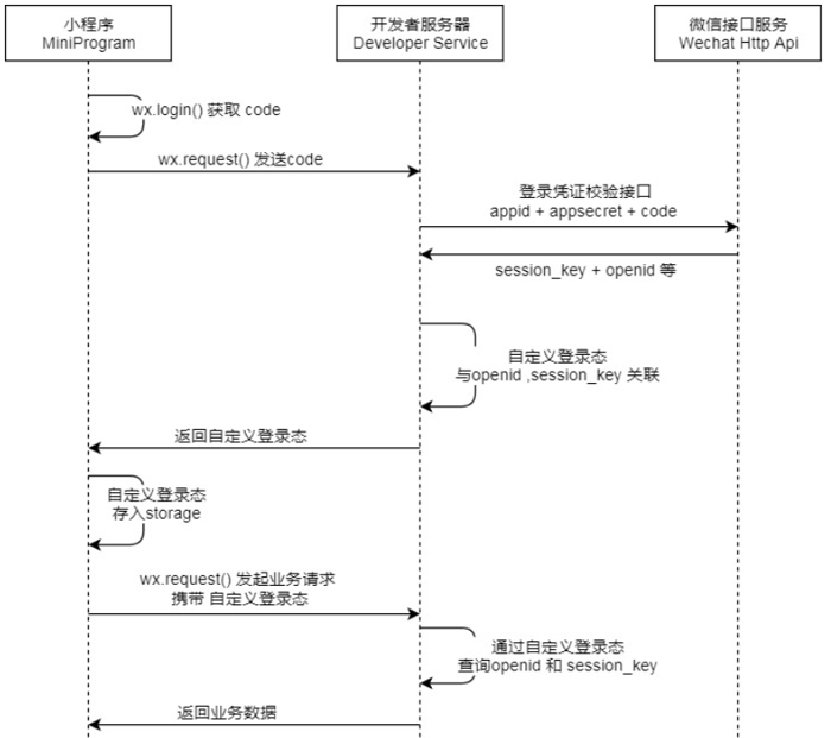

# Utopia Foods 说明书

​	Utopia Foods是专门为餐饮企业（餐厅、饭店）定制的一款软件产品，包括系统管理后台和移动端应用两部分。其中系统管理后台主 要提供给餐饮企业内部员工使用，可以对餐厅的菜品、套餐、订单等进行管理维护。移动端应用主要提供给消费者使用，可以在 线浏览菜品、添加购物车、下单等。

​	本项目后端基于Spring Boot、Spring MVC、Mybatis搭建，前端和小程序分别由Vue.js和H5搭建而成。这里仅上传了后端项目。

## 1.项目架构

+ 技术栈

**1). 用户层**  本项目中在构建系统管理后台的前端页面，我们会用到H5、Vue.js、ElementUI、apache echarts(展示图表)等技术。而在构建移动端应用时，我们会使用到微信小程序。 

**2). 网关层**  Nginx是一个服务器，主要用来作为Http服务器，部署静态资源，访问性能高。在Nginx中还有两个比较重要的作用： 反向代理和负载均衡， 在进行项目部署时，要实现Tomcat的负载均衡，就可以通过Nginx来实现。 

**3). 应用层**  SpringBoot： 快速构建Spring项目, 采用 "约定优于配置" 的思想, 简化Spring项目的配置开发。  SpringMVC：SpringMVC是spring框架的一个模块，springmvc和spring无需通过中间整合层进行整合，可以无缝集成。  Spring Task:  由Spring提供的定时任务框架。  httpclient:  主要实现了对http请求的发送。  Spring Cache:  由Spring提供的数据缓存框架  JWT:  用于对应用程序上的用户进行身份验证的标记。  阿里云OSS:  对象存储服务，在项目中主要存储文件，如图片等。  Swagger： 可以自动的帮助开发人员生成接口文档，并对接口进行测试。  POI:  封装了对Excel表格的常用操作。  WebSocket: 一种通信网络协议，使客户端和服务器之间的数据交换更加简单，用于项目的来单、催单功能实现。

**4). 数据层**  MySQL： 关系型数据库, 本项目的核心业务数据都会采用MySQL进行存储。  Redis： 基于key-value格式存储的内存数据库, 访问速度快, 经常使用它做缓存。  Mybatis： 本项目持久层将会使用Mybatis开发。  pagehelper:  分页插件。  spring data redis:  简化java代码操作Redis的API。

**5). 工具**  git: 版本控制工具, 在团队协作中, 使用该工具对项目中的代码进行管理。  maven: 项目构建工具。  junit：单元测试工具，开发人员功能实现完毕后，需要通过junit对功能进行单元测试。  postman:  接口测工具，模拟用户发起的各类HTTP请求，获取对应的响应结果。

+ 功能架构

 

+ 角色说明

  + 后台系统管理员：登录后台系统，拥有后台系统中的所有操作权限 后台系统

  + 普通员工：登录后台系统，对菜品、套餐、订单等进行管理 C端用户：登录移动端应用，可以浏览商品、添加购物车、设置地址、在线下单等

+ 数据库设计

  数据见sql文件。

 

​	包括用户地址表、菜单表、菜品表、菜品口味表、员工表、点餐详情表、点餐下单表、套餐表、套餐详情表、购物车表、用户（消费者表）等等。

+ 登录流程

 

+ 微信支付流程
  
 

## 2.目录说明

+ **sky-common**

  存放通用类、异常类、工具类以及第三方配置类：如阿里OSS、微信小程序、以及JWT令牌生成等等

+ **sky-pojo**

  存放实体类，和专门用于功能操作的相关变化的实体类。

+ **sky-server**

​	主要的功能实现模块。存放Controller、Mapper、Service层的代码以及resource配置类（用于启动Spring Boot工程），是项目的重点。

## 3.项目优化

​	在与小程序进行联调测试时，发现菜单商品数据响应的不是非常及时，因此采用redis对一些菜品进行缓存，使用Spring Data Redis 和Spring Cache注解的方式来提高菜单响应速率。

## 4.项目演示

​	视频演示地址：https://www.bilibili.com/video/BV1n34y137pj/?spm_id_from=333.999.list.card_archive.click&vd_source=3f80b35845e14481f1cabf8ead563f4a

